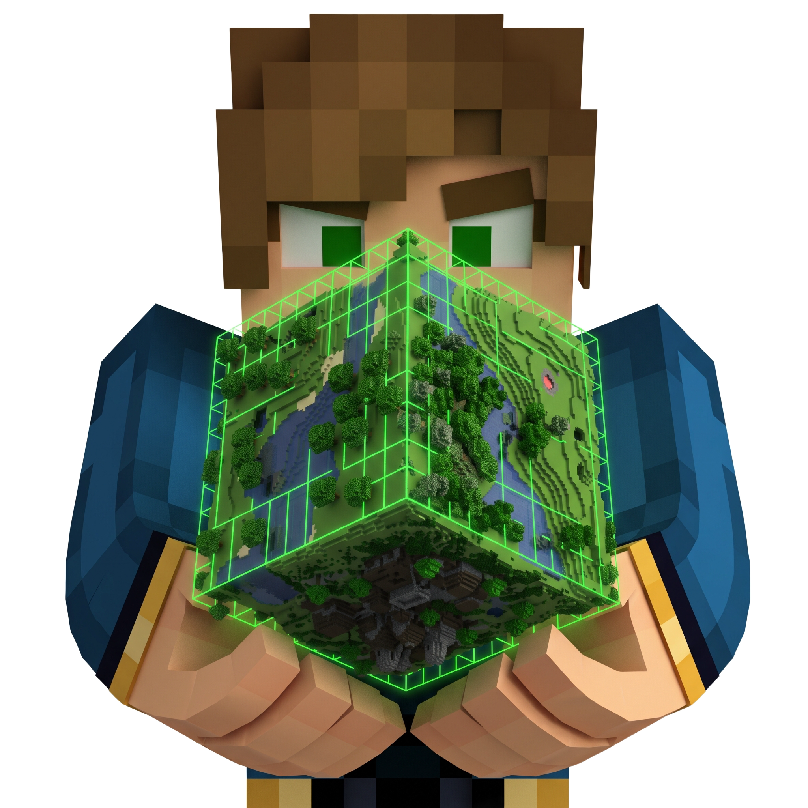

# GarnetMatrix

 

 
**Adds two rare, tool-and-block-locked custom enchantments: Vein Miner and Tree Capitator.**
 

 

GarnetMatrix is a lightweight Minecraft plugin that adds two powerful, rare custom enchantments to the game: **Vein Miner** and **Tree Capitator**. Both are designed to feel like a natural extension of vanilla enchanting rather than an overpowered shortcut — they're hard to get, and each one only works with the tool and block type it was built for.

## Features

- 🪓 **Two new enchantments**: Vein Miner and Tree Capitator
- 🎲 **Rare acquisition only** — no crafting recipe, no guaranteed source
- 🔒 **Tool-restricted** — each enchant only applies to the correct tool type
- ⛏️ **Block-restricted** — each enchant only triggers on the correct block type
- ⚙️ Drop-in installation, no configuration required to get started

## Enchantments

### Vein Miner

| | |
|---|---|
| **Applies to** | Pickaxes only |
| **Triggers on** | Ores only |
| **Obtained from** | Enchanting Table (rare) or Librarian Villager trades |

When you mine a block that is recognized as an ore, Vein Miner breaks the entire connected vein of the same ore type in one go, instead of just the single block. It will **not** trigger on stone, logs, or any other block — only recognized ore blocks.

### Tree Capitator

| | |
|---|---|
| **Applies to** | Axes only |
| **Triggers on** | Logs only |
| **Obtained from** | Enchanting Table (rare) or Librarian Villager trades |

When you chop a log block, Tree Capitator fells the entire connected tree (all attached log blocks) in one hit. It will **not** trigger on leaves, planks, or any other block — only recognized log blocks.

## How to Obtain the Enchantments

Since both enchantments are intentionally rare, there is no guaranteed way to get them:

- **Enchanting Table**: Small random chance to appear when enchanting a valid pickaxe or axe.
- **Librarian Villagers**: Small random chance to appear in their trade offers.

There is no `/enchant` command support by default, and the enchantments cannot be obtained via crafting or grinding — this is by design, to keep them special.

## Compatibility

- Requires a recent Paper server build (see Releases for tested versions).
- No dependency on other plugins.
